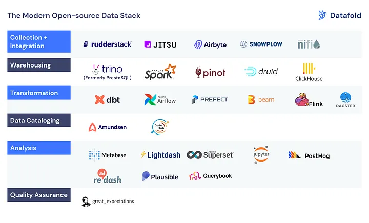
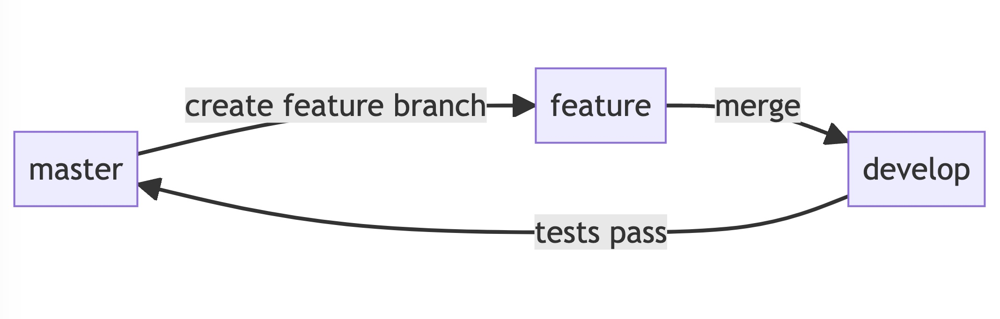

<style>
section {
  font-family: 'IBM Plex Mono';
}
</style>

# Integrating CI/CD Pipelines in Data Engineering
Presented by Nam Tonthat

---

# 📝 Agenda

1. 🔧 Open Stack Tools
2. 🏗️ Modern Data Stack
3. 🔄 ETL Process with Fivetran, `dbt` and Airflow
4. 🚀 Invoking CI/CD Pipelines
5. 👍 Data Engineering Best Practices
6. 📄 Various File Types in Data Engineering
7. 💡 Q&A and Interactive Session

---

# 🔧 Open Stack Tools


---

# 🏗️ Modern Data Stack


---

# 🔄 `ELT` - `EL` step
## Fivetran
- Managed PaaS to capture data into warehousing. 
- Uses CDC
- Ensuring consistent data pipeline performance
- [Live Demo](https://fivetran.com/welcome/select-source?groupId=splashy_decathlon)
 
---

# 🔄 `ELT` - `T` step
## `dbt`
- Streamlining SQL transformations with linage and integration with a lot of data governance
- Implementing version control and testing


---

# 🔄 `ELT` - `T` step
## `dbt`
### Sample script 
```
with customers as (

    select * from {{ ref('stg_customers') }}

),

orders as (

    select * from {{ ref('stg_orders') }}

)
```

---

# 🔄 `ELT` - the glue between `EL` and `T`
## Airflow - orchestrator

- Orchestrating complex data workflows
- Scheduling and monitoring with CI/CD practices
- [Live Demo](http://airflow-dev.skinfra.xyz:8080/home?search=workday)


---

# 📄 File Type Comparison

|      | CSV | JSON | Parquet | Delta | Avro |
|:----:|:---:|:----:|:-------:|:-----:|:----:|
| Human-readable | ✔️ | ✔️ | ❌ | ❌ | ❌ |
| Supports Nested Data | ❌ | ✔️ | ✔️ | ✔️ | ✔️ |
| Columnar Storage | ❌ | ❌ | ✔️ | ✔️ | ❌ |
| Efficient for Large Datasets | ❌ | ❌ | ✔️ | ✔️ | ✔️ |
| Fast Writes | ✔️ | ✔️ | ❌ | ❌ | ✔️ |
| Transaction Support | ❌ | ❌ | ❌ | ✔️ | ❌ |
| Schema Evolution | ❌ | ❌ | ✔️ | ✔️ | ✔️ |
| Broad Compatibility | ✔️ | ✔️ | ✔️ | ❌ | ✔️ |

---

# 🚀 Invoking CI/CD Pipelines

- Automating actions and behaviours
- *What do you think would be good triggers for CI/CD?*

Uses:
- Testing previous uses cases 
- Maintaining coding best practices via `flake8`, `bandit` and `black`


---

# 👍 Git strategy



---

# 💡 Q&A Session

- Your time to ask!
- Anything you'd like to know or discuss further?
