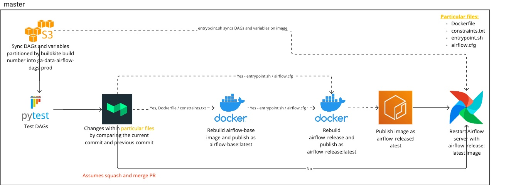

#  :office: Enterprise Data Ops Airflow

## :man: Presented by Nam Tonthat

## :calendar: 2023-06-21

---

# :notebook_with_decorative_cover: Agenda

- :rocket: CI/CD
    - Present
    - Planned

- :question: Questions

---

# :gift: Present CI/CD
- Builds a new image for any changes
- Publishes this image `~500 MB` each time on updated changes
- Takes 10 minutes for each build

---
# 🎯 Planned CI/CD
- Goals:
    - Reduce the time to build by 50%

- Achieved by:
    1. Sync `DAGs`/ `variables` into `ga-data-airflow-dags-{env}` S3 bucket.
    2. Splitting the Dockerfile into a multi stage build
      - `airflow_base`: for requirements
      - `airflow_release`: for `entrypoint.sh` / `airflow.cfg` changes
    3. Update `entrypoint.sh` using `aws s3 sync` to sync DAGs back

- *Other changes*:
    - Using SEEK's open source software plugins (`seek-oss/docker-ecr-publish`)
---
# 🎯 Planned CI/CD - `develop`

---

# 🎯 Planned CI/CD - `master`
Difference between `develop` and `master` is that each PR is a **squash and merge**.

---

# :clock1: Timing differences - Present CI/CD
- Build time: 10 minutes

---
# :clock1: Timing differences - Planned CI/CD
- Build times:
    - 5 minutes for DAG / variable changes (most of the time ~95%)
    - 10 minutes for rebuilding image

---

## :question: Questions

