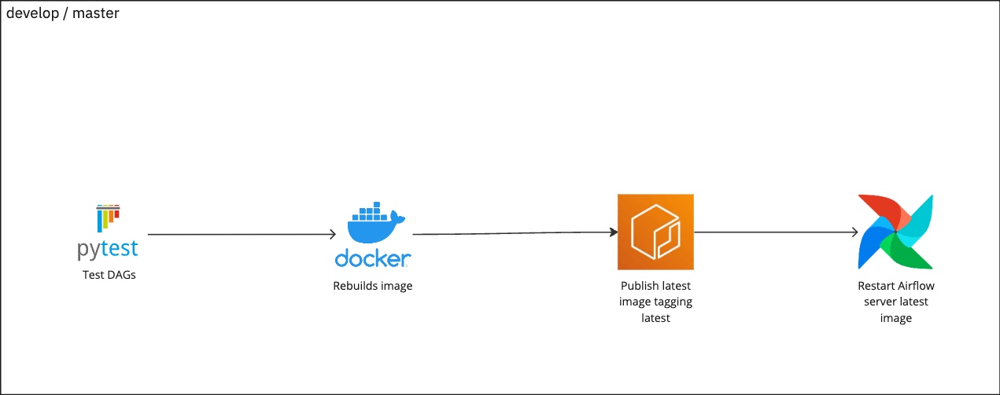
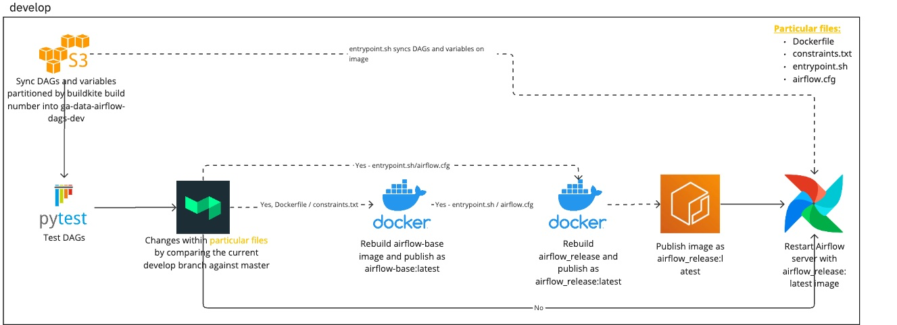
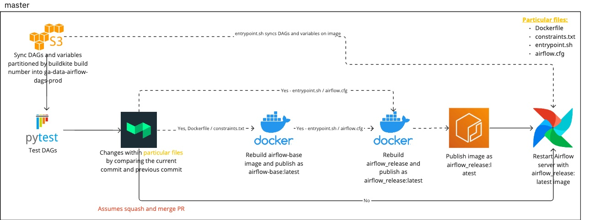
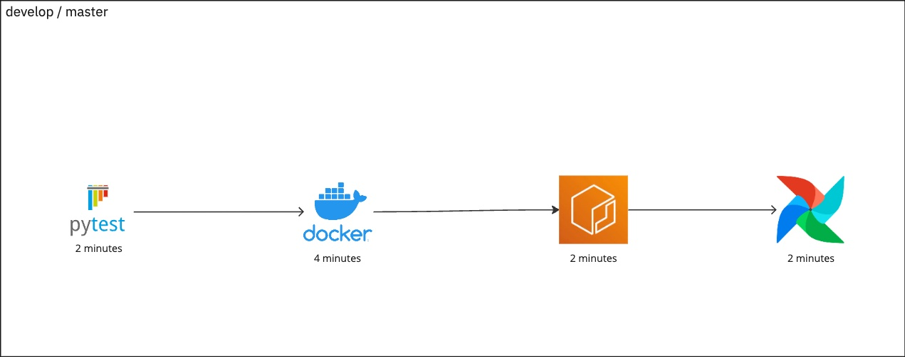
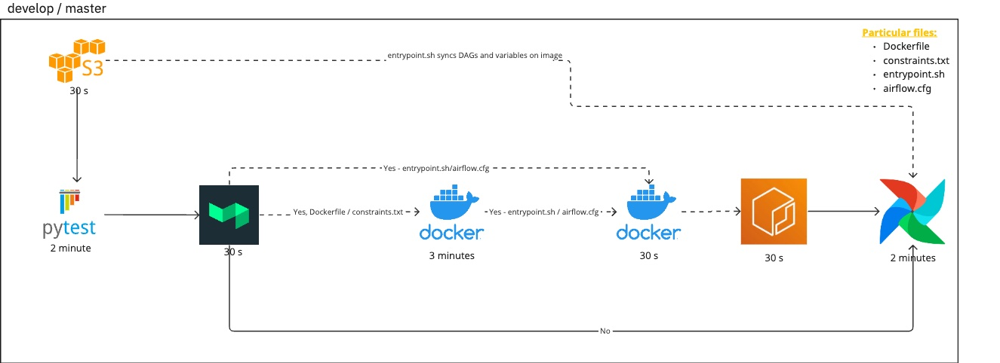
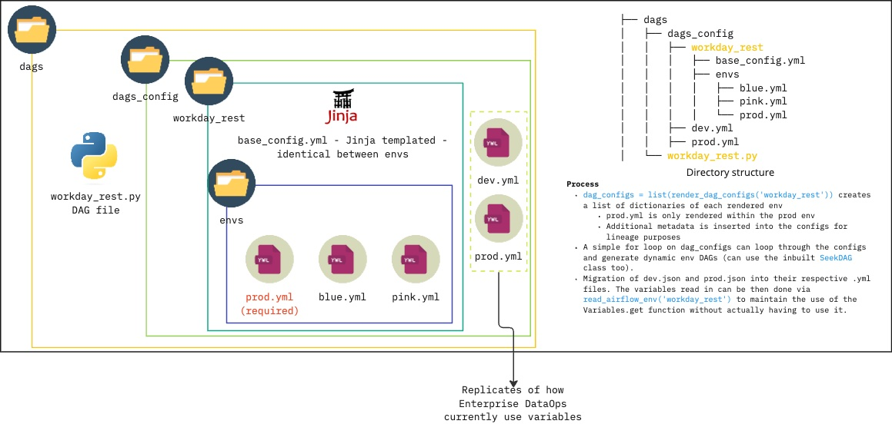

<style>
section {
  font-family: 'SEEK Sans';
}
</style>


#  :office: Enterprise Data Ops Airflow

## :man: Presented by Nam Tonthat

## :calendar: 2023-06-21


---

# :notebook_with_decorative_cover: Agenda

- :rocket: CI/CD
    - Present
    - Planned

- :rainbow: Future of Airflow
- :question: Questions


---

# :gift: Present CI/CD
- Builds a new image for any changes
- Publishes this image `~500 MB` each time on updated changes
- Takes 10 minutes for each build



---
# 🎯 Planned CI/CD
- Goals:
    - Reduce the time to build by 50%

- Achieved by:
    1. Sync `DAGs`/ `variables` into `ga-data-airflow-dags-{env}` S3 bucket.
    2. Splitting the Dockerfile into a multi stage build
      - `airflow_base`: for requirements
      - `airflow_release`: for `entrypoint.sh` / `airflow.cfg` changes
    3. Update `entrypoint.sh` using `aws s3 sync` to sync DAGs back

- *Other changes*:
    - Using SEEK's open source software plugins (`seek-oss/docker-ecr-publish`)
---
# 🎯 Planned CI/CD - `develop`


---

# 🎯 Planned CI/CD - `master`
Difference between `develop` and `master` is that each PR is a **squash and merge**.


---

# :clock1: Timing differences - Present CI/CD
- Build time: 10 minutes



---
# :clock1: Timing differences - Planned CI/CD
- Build times:
    - 5 minutes for DAG / variable changes (most of the time ~95%)
    - 10 minutes for rebuilding image



---

# :rocket: Future Airflow
- The use of `variables`
- Dynamic DAGs
- Airflow upgrades

---
## Use of `variables`


- Migration of all `variables` from `dev.yml` and `prod.yml`
- Use `common_airflow.read_airflow_env()` function to pull variables.


---
## Dynamic DAGs
### 🎯 Motivation
Reduce manual effort maintaing multiple DAGs for different envs

### 🏗️ Planned Implementation
- A`base_config.yml` in `Jinja2` template to have a consistently render each DAG
- Different `dags_config/<dag_name>/envs` files
- Use `common_airflow.render_dag_configs` function; adds additional metadata on rendering.

---

## Dynamic DAGs
### 🎁 Putting it all together



---

## Dynamic DAGs

`base_config.yml`

```
pipeline_suffix: "{{ pipeline_suffix }}"
concurrency: {{ concurrency }}
default_args:
  retries: 1
  retry_delay: {{ default_args.retry_delay }}
list_schedule_interval: {{ list_schedule_interval }}
optimise_schedule_interval: {{ optimise_schedule_interval }}
optimise_glue_databases: {{ optimise_glue_databases }}
optimise_instance_upsize_objects:
  - raw/ecc/gl_items/gl_line_items/
  - raw/ecc/copa_items/copa_items/
  - transformed/semantic.fact_talent_search_activity.delta/
```
---

## Dynamic DAGs

`prod.yml`
```
pipeline_suffix: ""
concurrency: 40
default_args:
  retry_delay: 300
list_schedule_interval: 30 21 * * SAT
optimise_schedule_interval: 0 22 * * SAT
optimise_glue_databases:
  - spectrum_general
  - spectrum_base
  - spectrum_raw
  - spectrum_salesforce
```
---
## Dynamic DAGs

`Sample Code`

```
dags_configs = list(render_dag_configs())

for dag_config in dags_configs:
    # additional metadata `render_dag_configs()`
    dag_config_file_name = dag_config.get("file_name")
    base_dag_name = dag_config.get("base_dag_name")
    seek_env = dag_config.get("seek_env")
    config_absolute_path = dag_config.get('config_absolute_path')
    dag_id = dag_config.get('dag_id')


    with SeekDAG(
        dag_id=dag_config.get("dag_id"),
        catchup=False,
        default_args=default_args,
        concurrency=dag_config.get("concurrency"),
        doc_md=airflow_md_env,
        max_active_runs=1,
        schedule_interval=dag_config.get("optimise_schedule_interval"),
        start_date=datetime(2023, 2, 10, tzinfo=local_tz),
        seek_env_config=dag_config,
        tags=tags,
    ) as dag:
        logging.info("Rendering DAG %s", dag.dag_id)
        globals()[dag.dag_id] = dag

```

---

## Airflow upgrades
- Work planned to start from July 2023
- Migration from 1.10.15 to 2.6.2 (with support for Python 3.11)
- Planned changes
    - Backup Postgres database
    - Update all operators
    - Run `upgrade_check` CLI tool
- Post upgrade change - migrate all `JSON` variables into `YML` files

---

## :question: Questions


---

## 📑 References

- [Migration to Airflow 2](https://airflowsummit.org/slides/2021/c6-UpgradingAirflow2.pdf)

